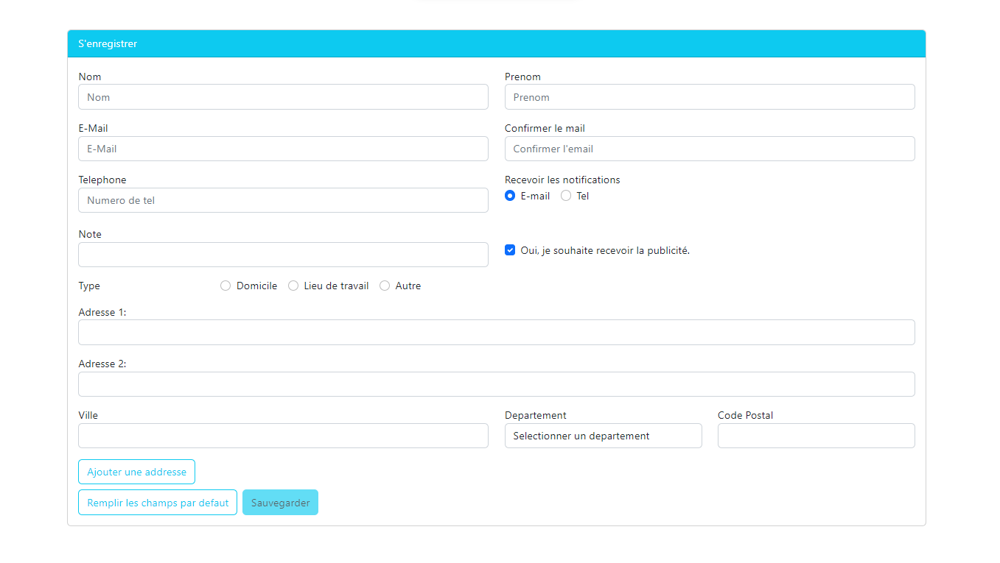

# AngularForms

This project was generated with [Angular CLI](https://github.com/angular/angular-cli) version 14.1.0.
It is aimed to apply, practice in order to better understand Angular Forms.

## Concepts
- Reactive Forms
- Customer validators
- Genreric validator
- Rxjs for reactive programming

## Usage

- Download the code
- Dependencies installation : `npm install`
- Applicaiton running : `npm run start`

## Final look

